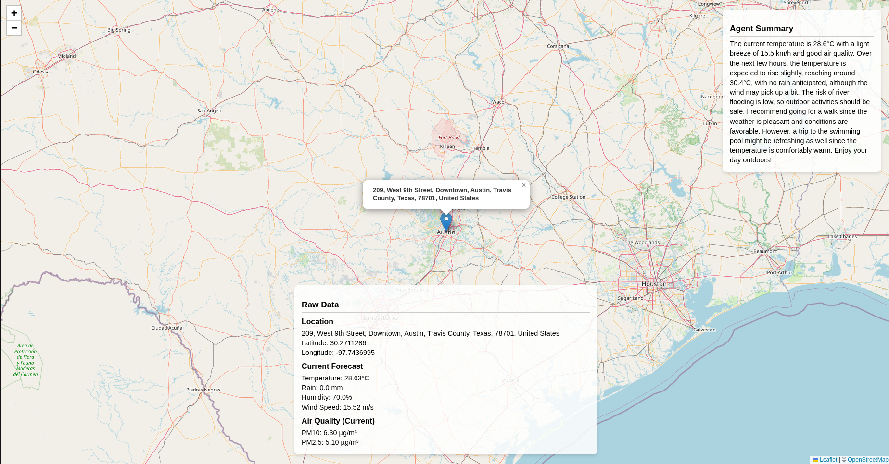
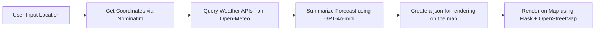

# Weather Insight and Forecast App

This project is a weather intelligence web application that:
- Takes a **location input** from the user
- Uses **OpenStreetMap (Nominatim)** to fetch coordinates
- Uses **Open-Meteo APIs** to fetch:
  - Weather forecast
  - Air quality
  - River discharge
- Uses **GPT-4o-mini via CrewAI** to summarize weather information into human-readable insights
- Uses **Flask** to display location and forecast info on an interactive map with OpenStreetMap

---
## 📸 Screenshot




## 🔧 Features

- 🌍 Location-based querying
- 📡 Real-time weather insights
- 🧠 AI summary with GPT-4o-mini
- 🗺️ Map display using Flask + OpenStreetMap
- 🕒 Planned cron jobs for auto-refresh (every 10–15 min)
- 🐳 Future support for Docker and Docker Compose

---

## 🚀 How it Works



---

## 📦 Setup

### 1. Clone the Repository

```bash
git clone https://github.com/your-username/weather-insight-app.git
cd weather-insight-app
```

### 2. Create Environment

```bash
conda create -n weather_env python=3.12 -y
conda activate weather_env
pip install -r requirements.txt
```

### 3. Set Environment Variables

Create a `.env` file and set:

```
OPENAI_API_KEY=your_openai_key_here
```

---

## 📁 File Structure

```
.
├── app.py                   # Flask app to serve map + weather
├── weather_forecast.json   # Stores latest summarized forecast
├── tools/
│   └── Weather_tools.py        # Custom tools for CrewAI
├── requirements.txt
├── templates/
│   └── index.html            # HTML template for Flask
└── README.md
```

---

## 📌 Dependencies

- `requests`, `flask`, `pandas`, `python-dotenv`
- `crewai`, `langchain_community`
- `openai`, `pydantic`

---

## 🗺️ Credits

- **OpenStreetMap** – for geocoding and map visualization
- **Open-Meteo** – for weather and environmental APIs
- **OpenAI / CrewAI** – for summarizing large weather data
